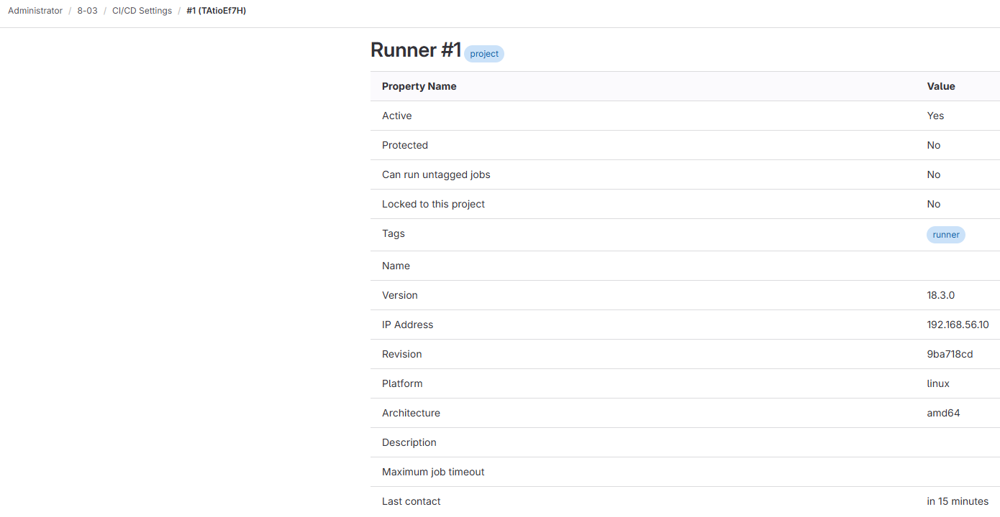
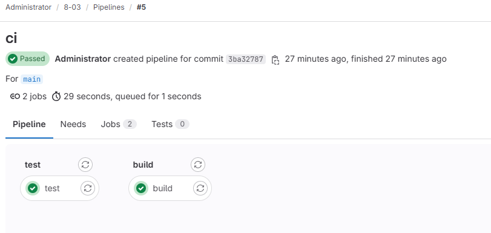

# Домашнее задание к занятию "`Домашнее задание по лекции "GitLab"`" - `Прокутин ДВ`

### Дополнительные материалы, которые могут быть полезны для выполнения задания

1. [Руководство по оформлению Markdown файлов](https://gist.github.com/Jekins/2bf2d0638163f1294637#Code)

---

### Задание 1

---

### Задание 2

[yaml файл](.gitlab-ci.yml)

---

